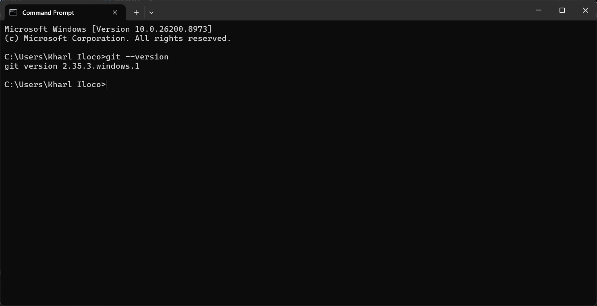
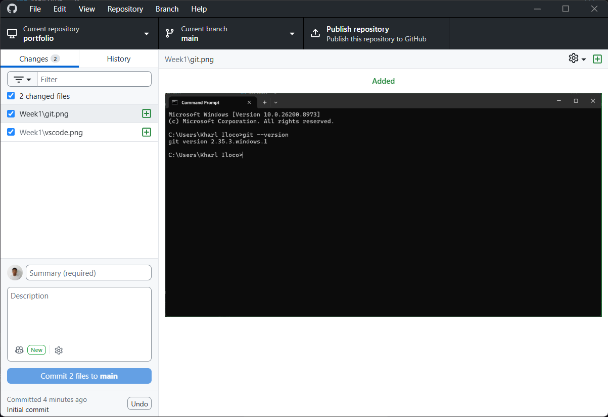
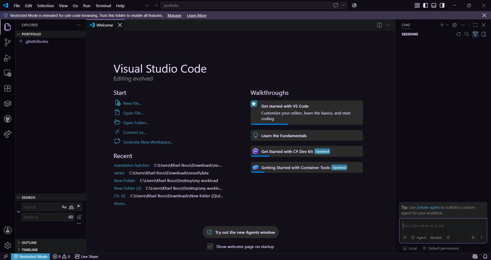

# Week 1 – Building My Professional Environment

## Student Information

- **Name:** Renz Rouei Villegas
- **Program:** Bachelor of Science in Information Technology (BSIT)
- **Course:** ITEP 414 – System Administration and Maintenance
- **Section:** BSIT-4B
- **Date:** 8/8/2026

---

## Objectives

The objectives of this week's activities were to:

- Prepare a workstation for future System Administration and Maintenance activities.
- Install and become familiar with essential development and virtualization tools.
- Set up professional GitHub and LinkedIn profiles.
- Learn how Git and GitHub can be used for version control and technical documentation.
- Create an organized GitHub repository for documenting activities throughout the semester.
- Establish a professional online presence and portfolio.

---

## Software Installed

The following software and resources were installed or prepared during Week 1:

- **Git** – Version control system
- **GitHub Desktop** – Graphical interface for Git and GitHub
- **Visual Studio Code** – Source code editor
- **VirtualBox** – Virtual machine platform
- **Ubuntu Desktop ISO** – Linux operating system image
- **Windows 11 Enterprise Evaluation ISO** – Windows operating system image

---

## Professional Accounts

- **GitHub:** [RR-Villegas](https://github.com/RR-Villegas)
- **LinkedIn:** [Renz Rouei Villegas](https://www.linkedin.com/in/renz-rouei-villegas-0a3932427/)

During this activity, I also updated my GitHub and LinkedIn profiles to better represent my skills, academic background, projects, and certifications.

---

## Installation Screenshots

### Git

### GitHub Desktop

### Visual Studio Code

### VirtualBox
 (Omitted due to hardware limitations)

### Ubuntu Desktop ISO
 (Omitted due to hardware limitations)

### Windows 11 Enterprise Evaluation ISO
 (Omitted due to hardware limitations)

---

## Challenges Encountered

### 1. Organizing the Repository

One challenge was determining how to properly organize the files and folders for the semester. I resolved this by following the required repository structure and creating separate folders for each week.

### 2. Setting Up Professional Profiles

Another challenge was deciding what information to include on my GitHub and LinkedIn profiles. I focused on information relevant to my current skills, academic experience, certifications, and projects while keeping the profiles professional.

### 3. Learning the Git and GitHub Workflow

Becoming familiar with how local files, Git, GitHub Desktop, and a remote GitHub repository work together required some adjustment. I practiced making changes, committing them, and pushing them to the repository to better understand the workflow.

---

## Reflection

Week 1 of System Administration and Maintenance focused on preparing the environment and tools that will be used throughout the semester. Through the activities, I learned that having an organized workspace is important when working on technical projects, especially when multiple files, configurations, and documentation need to be maintained over time.

Setting up Git and GitHub also gave me a better understanding of how version control can be used to manage and document my work. GitHub provides a place where I can keep my weekly activities organized while also building a portfolio that shows my progress throughout the course. I also prepared Visual Studio Code, VirtualBox, Ubuntu, and Windows resources that will be useful for future laboratory exercises involving different systems and environments.

Another part of the activity involved improving my professional presence through GitHub and LinkedIn. This helped me recognize that documenting projects and presenting technical skills are also important parts of professional development in IT.

Overall, the first week provided a foundation for the activities that will follow. As the course progresses, I hope to become more comfortable working with different operating systems, system administration tools, and troubleshooting processes while continuing to improve my technical and documentation skills.

---

## References

- [Git](https://git-scm.com/)
- [GitHub](https://github.com/)
- [GitHub Desktop](https://desktop.github.com/)
- [Visual Studio Code](https://code.visualstudio.com/)
- [VirtualBox](https://www.virtualbox.org/)
- [Ubuntu](https://ubuntu.com/)
- [Microsoft Evaluation Center](https://www.microsoft.com/evalcenter/)
